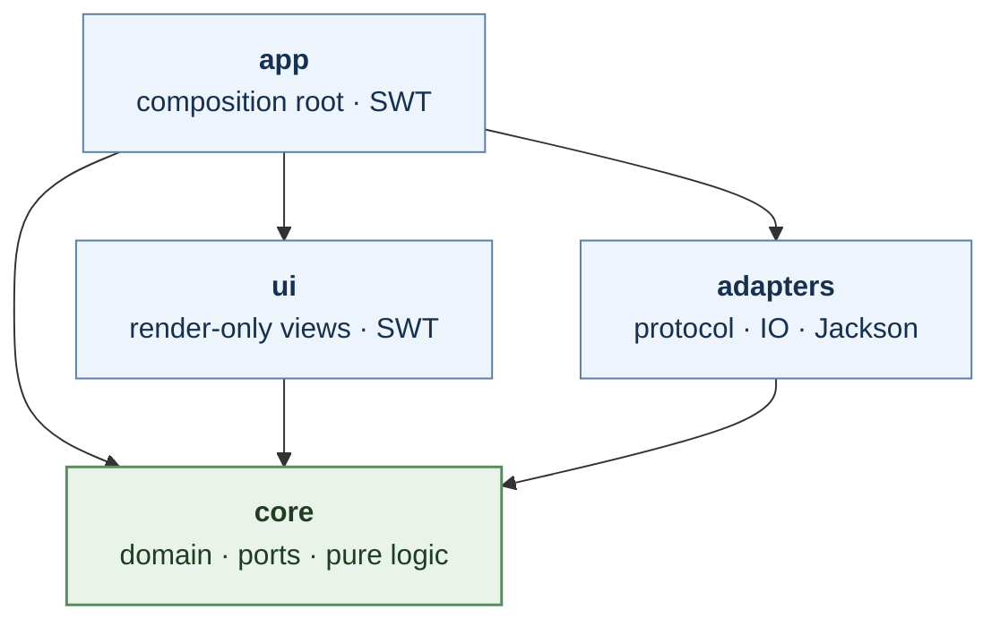
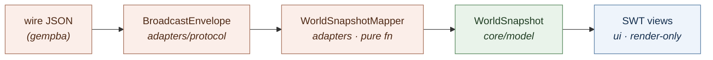
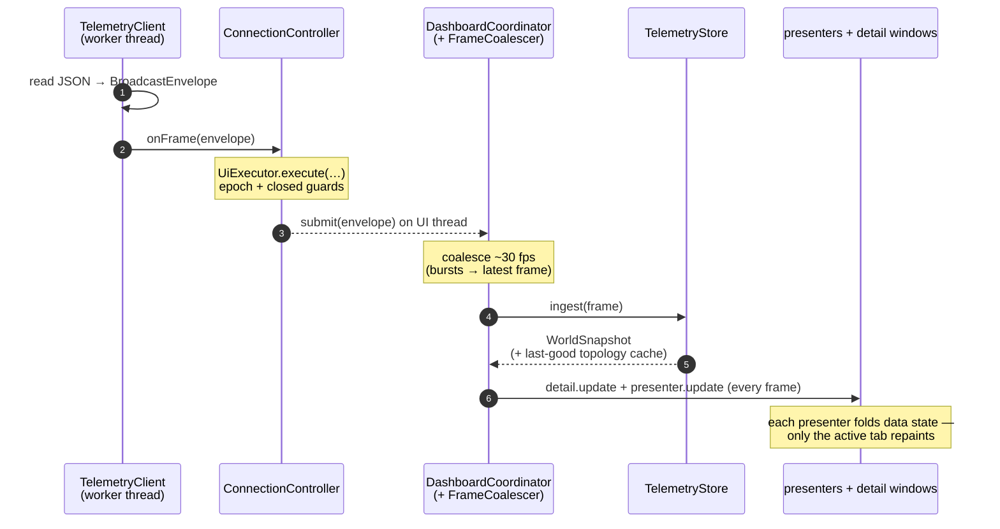

# Architecture

GemPBA Dashboard is an SWT desktop client for the GemPBA parallel
branch-and-bound framework's telemetry stream. It is built as **MVP (Supervising
Presenter) over a Hexagonal, Ports-and-Adapters core**, packaged as a **Maven
multi-module reactor whose module graph compile-enforces the dependency rule**.

The single sentence that captures the design:

> The UI renders an immutable domain read-model; the wire format never reaches
> it — and *cannot*, because the compiler won't let it.

---

## The modules (the dependency graph *is* the enforcement)



Read it top-down: `app` wires everything; `ui` and `adapters` are siblings that
**never reference each other**; every arrow points inward to `core`, which
depends on nothing. The edge that is *deliberately missing* — **`ui → adapters`**
— is the whole rule: with no path to the `adapters` module, a `ui` class cannot
import the wire `protocol` that lives there. The compiler proves it below.

Each module's Maven artifactId is just its bare name (`io.gempba:core`,
`:adapters`, `:ui`, `:app`) — the umbrella is already the parent
`io.gempba:gempba-dashboard`.

| Module | Depends on | May use | Holds |
|--------|-----------|---------|-------|
| **core** | *(nothing)* | JDK only | domain read-model (`model`), value objects (`config`), pure policies (`policy`), formatting (`format`), view contracts (`view`), presenters (`presenter`), threading port (`concurrent`), pure SSH command (`ssh`), history buffer (`history`) |
| **adapters** | core | + Jackson | wire DTOs + parser (`protocol`), telemetry client (`client`), SSH tunnel IO (`adapter.ssh`), connection controller (`connection`), `protocol → WorldSnapshot` mapper + store (`telemetry`) |
| **ui** | core | + SWT | the SWT render-only views: card hierarchy, tile grid, dialogs, settings strip |
| **app** | core, adapters, ui | + SWT | `Main`, the composition root, the `DashboardCoordinator` frame pipeline, `SwtUiExecutor`, icons |

The edges that **don't** exist are the load-bearing ones:

- **`ui` does not depend on `adapters`.** The wire `protocol` DTOs live in
  `adapters`, so a `ui` class cannot import them — there is no path on its
  compile classpath. This is the central rule, and it is enforced by `javac`,
  not by convention or a linter.
- **`adapters` does not depend on SWT.** The connection controller marshals its
  callbacks onto the UI thread through the `core` `UiExecutor` *port*, whose SWT
  implementation (`SwtUiExecutor`) is supplied by `app`. That indirection is
  what lets the controller live in the toolkit-free adapter layer.
- **`core` depends on nothing.** No SWT, no Jackson, no `java.net`. Everything
  points inward to it.

### Proof of enforcement

```
$ mvn -pl ui dependency:tree
io.gempba:ui
+- io.gempba:core:compile
+- org.eclipse.platform:org.eclipse.swt…:compile
\- (test only) junit, assertj           ← no jackson, no adapters

# add `import io.gempba.dashboard.protocol.BroadcastEnvelope;` to any ui class:
$ mvn -pl ui compile
[ERROR] package io.gempba.dashboard.protocol does not exist
[INFO] BUILD FAILURE
```

---

## The MVP seam

The pattern is **MVP, Supervising-Presenter flavor**, with one consistent
vocabulary (so "View" never means two things):

- **Model** — immutable read-model records, suffix `*Snapshot` (`core/model`).
- **View** — the SWT widgets (`ui`) behind view contracts (`core/view`).
  "View" means *only* UI.
- **Presenter** — one per tab (`core/presenter`), SWT-free → unit-testable.
- **Coordinator** — `DashboardCoordinator` (`app`): the thin orchestrator that
  owns the session and fans each frame to the presenters.

Everything the UI shows is derived from one immutable value, the
**`WorldSnapshot`** (`core/model`): a frame's worth of state as a tree of
`NodeSnapshot → SocketSnapshot → WorkerSnapshot`/`CoreUsageSnapshot`, plus a
`StructureKey`. It holds **raw magnitudes only** — no formatted strings, no SWT,
and no `protocol` type.



- **The mapper is the only translator.** `WorldSnapshotMapper` is a pure
  function `BroadcastEnvelope → WorldSnapshot`. It consolidates what used to be
  scattered across the SWT cards — the three-pass index/join of node frames,
  topology, and identities; the node-header precedence rules; the
  `allowed_cpu_ids ∩ socket cpu_ids` core-usage join; and the per-allocation CPU
  metric. Being pure, it is unit-tested in isolation (it has no SWT to stand up).
- **Views are render-only (Supervising Presenter).** Each view contract
  (`GridView`, `CardsView`, …) has exactly one SWT implementation, named by
  convention `Swt*` (matching `SwtUiExecutor`):
  `SwtGridView.render(seriesByHost)`, `SwtCardsView.render(WorldSnapshot)`,
  `SwtDetailView.update(WorldSnapshot)`. Each is told what to show and formats
  trivial values itself; it pulls nothing. The two renderable tab views share
  the generic contract `view.View<T>` (`render(T)` + `clear()`); the detail
  window renders `snapshot.forHost(host)`, a pure read-model narrowing that
  replaced the old wire-level envelope filtering.
- **Presenters own orchestration, SWT-free.** `Presenter` (`update` + `clear`)
  is the generic frame-consumer contract; a generic `TabPresenter<T>` layers the
  tab lifecycle on top (the active flag, "fold data every frame but repaint only
  when active", tear-down), so each concrete tab presenter is just its
  projection: `GridPresenter extends TabPresenter<Map<host,NodeSeries>>` owns
  the history buffer and projects per-host series (which is what removed the old
  reach-in where the grid widget pulled from the store); `CardsPresenter extends
  TabPresenter<WorldSnapshot>` is the identity projection. `DetailWindowsPresenter`
  owns the live detail windows and implements the slim `Presenter` contract
  directly (always-on, no tab lifecycle). Holding no SWT, they're unit-tested
  with fake views.
- **The coordinator is the thin "global controller".** `DashboardCoordinator`
  (`app`) owns the frame pipeline (coalescer, mapping, history + detail-windows
  every frame, render-active-tab-only) and the session lifecycle (tab switch,
  reset), driving the presenters polymorphically through the `Presenter` contract
  — it never touches a widget. `DashboardApp` is just the composition root that
  builds the graph and runs the loop.

### Ports

| Port (core) | Implementation | Why |
|-------------|----------------|-----|
| `concurrent.UiExecutor` | `app.SwtUiExecutor` (`Display.asyncExec`) | keeps `Display` out of the connection controller, so `connection` is SWT-free |
| `view.GridView`/`CardsView`/`DetailView`/`StatusView`/`SettingsView` (the tab views extend `view.View<T>`) | `ui.SwtGridView`/`SwtCardsView`/`SwtDetailView`/`SwtStatusView`/`SwtSettingsView` | view contracts the presenters and coordinator drive without naming a widget |
| `presenter.Presenter` (`update`/`clear`; tabs add the lifecycle via `TabPresenter<T>`) | `GridPresenter`, `CardsPresenter`, `DetailWindowsPresenter` | the extensible backbone the coordinator fans each frame to; a new tab = one `TabPresenter<T>` subclass, a new always-on presenter = one `Presenter` |
| `ssh.SshCommand` (pure) | `adapter.ssh.SshTunnel` (IO) delegates to it | the settings strip previews the command from `core`; spawning stays in `adapters` |

---

## Live data flow



1. `TelemetryClient` (adapters, worker thread) reads JSON, parses to
   `BroadcastEnvelope`, calls `FrameListener.onFrame`.
2. `ConnectionController` (adapters) hops the callback onto the UI thread via the
   `UiExecutor` port, guarded by an epoch counter (so a torn-down connection's
   late frames are dropped) and a closed flag.
3. `DashboardCoordinator` (app) receives frames on the UI thread and feeds them
   to a `FrameCoalescer` (~30 fps): bursts collapse to the latest frame, so the
   dashboard never renders faster than the eye resolves.
4. Each surviving frame is mapped once by `TelemetryStore.ingest` (which also
   caches the last-good topology, so a stray null-topology frame can't orphan the
   model), then handed to every open detail window and to **every** presenter's
   `update` — **every frame, regardless of tab**. Each presenter folds its data
   state (the grid folds the `NodeHistoryStore` sparkline buffer) but only the
   **active** tab's presenter repaints.

---

## Notable decisions

- **Per-allocation CPU — "your cores, your work."** The tile graph is
  `clamp(Σ rank cpu ÷ |⋃ allocated cores|, 0, 100)`: the user's own processes'
  CPU over the cores they were allocated, excluding other tenants on a shared
  node. The clamp is a pure `core` policy (`NodeUtilization`); gathering its
  inputs is the mapper's join. (Acceptance scenarios live in
  `WorldSnapshotMapperTest`; the arithmetic in `NodeUtilizationTest`.)
- **Relayout elision via `StructureKey`.** A frame whose `host|socket|worker`
  signature equals the previous one added or removed no cards, so the expensive
  scrolled-content remeasure is skipped. The signature is computed once by the
  mapper and rides on the model.
- **Visibility-gated rendering.** Collapsed or off-screen cards skip their
  per-frame text updates and repaint from cache the moment they're revealed —
  keeping scroll smooth under a fast telemetry cadence.
- **Diff-before-paint.** Labels and headers are only rewritten when their text
  actually changed, eliding the native repaint (and flicker) for the common case
  of unchanged counters.

---

## Build & run

```
mvn -B test                       # build + test the whole reactor
mvn -B install -DskipTests        # install the modules locally, then…
mvn -B -pl app exec:java          # …launch the dashboard
```

SWT's per-platform native artifact is selected automatically by an OS-activated
Maven profile (Windows / Linux x86_64 + aarch64 / macOS x86_64 + aarch64).

## Tests

118 tests, all in `core` and `adapters` — exactly the modules with logic worth
asserting. The `ui` and `app` modules are deliberately thin (render-only views and
composition) and carry no unit tests; they are exercised by launching the app.
The pure mapper, the per-allocation policy, the SSH command authoring, the
history buffer, the JSON protocol — and now the **presenters** (`GridPresenter`,
`CardsPresenter`, `DetailWindowsPresenter`, driven against fake views) — are each
tested in isolation. That last group is the dividend of MVP: the orchestration
that used to live in untestable SWT lambdas is now SWT-free and asserted.
